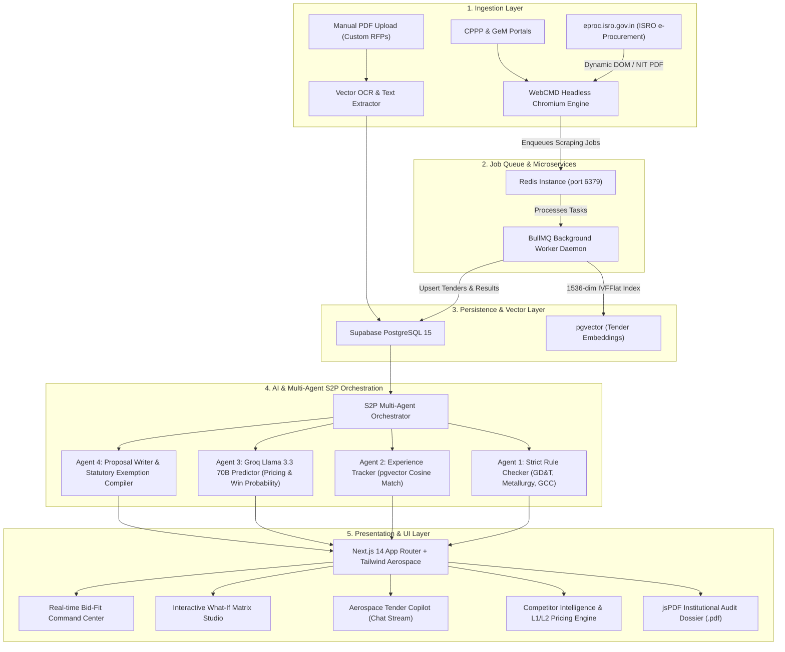
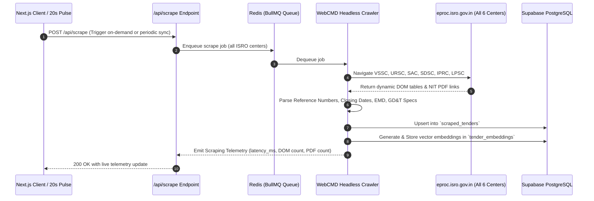
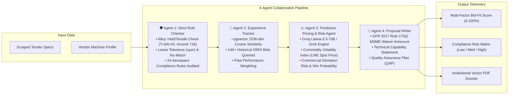
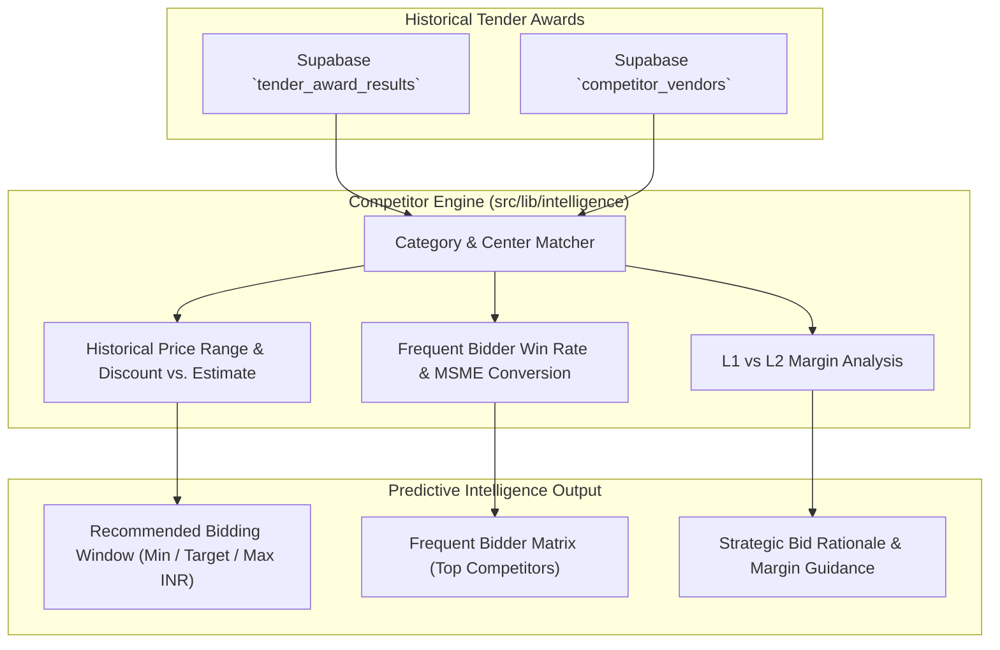
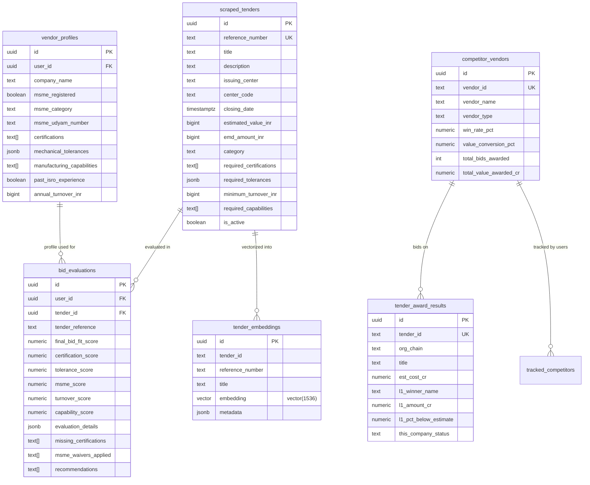

# 🇮🇳 ISRO Bid-Fit Scanner Enterprise
### Autonomous E-Procurement Intelligence, Multi-Agent S2P Pipeline, WebCMD Scraper & Statutory MSME Compliance Engine

[](https://nextjs.org/)
[](https://www.typescriptlang.org/)
[](https://tailwindcss.com/)
[](https://motion.dev/)
[](https://supabase.com/)
[](https://github.com/pgvector/pgvector)
[](https://groq.com/)
[](https://redis.io/)
[](https://clerk.com/)
[](https://github.com/Ayushnot41/isro-bid-fit-scanner-enterprise)
[_%26_ISRO_GCC-E05624?style=flat-square)]()

---

## 📑 Table of Contents

1. [Executive Summary & Problem Statement](#-executive-summary--problem-statement)
2. [End-to-End System Architecture](#-end-to-end-system-architecture)
   - [High-Level Topology](#high-level-topology)
   - [WebCMD Autonomous Scraping & Ingestion Pipeline](#webcmd-autonomous-scraping--ingestion-pipeline)
   - [4-Agent Source-to-Pay (S2P) AI Pipeline Flow](#4-agent-source-to-pay-s2p-ai-pipeline-flow)
   - [Competitor Intelligence & Historical Award Analytics](#competitor-intelligence--historical-award-analytics)
3. [Core Feature Deep-Dive](#-core-feature-deep-dive)
4. [Mathematical Formulation & Scoring Model](#-mathematical-formulation--scoring-model)
5. [Repository & Directory Structure](#-repository--directory-structure)
6. [Database Schema & Vector Architecture](#-database-schema--vector-architecture)
7. [REST API Reference & Webhook Contracts](#-rest-api-reference--webhook-contracts)
8. [Environment Configuration](#-environment-configuration)
9. [Installation, Docker & Production Deployment](#-installation-docker--production-deployment)
10. [Statutory & Compliance References](#-statutory--compliance-references)

---

## 🛰️ Executive Summary & Problem Statement

The **Indian Space Research Organisation (ISRO)** regularly publishes high-stakes technical tenders across its distributed centers—including **VSSC** (Vikram Sarabhai Space Centre, Trivandrum), **URSC** (U R Rao Satellite Centre, Bengaluru), **SAC** (Space Applications Centre, Ahmedabad), **SDSC SHAR** (Satish Dhawan Space Centre, Sriharikota), **IPRC** (ISRO Propulsion Complex, Mahendragiri), and **LPSC** (Liquid Propulsion Systems Centre, Valiamala).

### The Challenge
- **Massive Tender Dossiers**: Tenders span 100+ pages of Notice Inviting Tender (NIT), Special Conditions of Contract (SCC), and General Conditions of Contract (GCC).
- **Extreme Engineering Tolerances**: Requirements demand micrometer-level linear tolerances ($\pm 5\ \mu\text{m}$), surface roughness ($Ra \le 0.4\ \mu\text{m}$), aerospace superalloys (**Ti-6Al-4V Grade 5**, **Inconel 718**, **AA2219**), and 5-axis simultaneous CNC milling.
- **Zero Margin for Error**: Any unfulfilled accreditation (AS9100D, ISO 9001:2015, NABL ISO/IEC 17025) or drawing non-compliance causes instant technical disqualification.
- **Complex Financial & Statutory Provisions**: Vendors often fail to leverage statutory exemptions under **Rule 170(i) of General Financial Rules (GFR) 2017** for ₹0 Earnest Money Deposit (EMD) and the 25% MSME purchase preference band.

### The Solution: ISRO Bid-Fit Scanner Enterprise
An enterprise aerospace procurement intelligence platform that combines **WebCMD autonomous headless crawling**, **4-agent AI orchestration**, **pgvector continuous semantic memory**, **Strength of Materials metallurgy validation**, **Competitor L1/L2 pricing analytics**, and **institutional-grade PDF audit dossier generation**.

---

## 🏗️ End-to-End System Architecture

### High-Level Topology



---

### WebCMD Autonomous Scraping & Ingestion Pipeline



---

### 4-Agent Source-to-Pay (S2P) AI Pipeline Flow



---

### Competitor Intelligence & Historical Award Analytics



---

## ✨ Core Feature Deep-Dive

### 1. Autonomous WebCMD Crawler (`eproc.isro.gov.in`)
- Headless Chromium architecture running inside a decoupled Docker daemon.
- Scans all 6 major ISRO procurement centers concurrently:
  - **VSSC** (Vikram Sarabhai Space Centre, Trivandrum)
  - **URSC** (U R Rao Satellite Centre, Bengaluru)
  - **SAC** (Space Applications Centre, Ahmedabad)
  - **SDSC SHAR** (Satish Dhawan Space Centre, Sriharikota)
  - **IPRC** (ISRO Propulsion Complex, Mahendragiri)
  - **LPSC** (Liquid Propulsion Systems Centre, Valiamala)
- Automatic 20-second background synchronization pulse with real-time UI indicator.
- Extracts NIT reference codes, opening/closing timestamps, estimated budgets, EMD values, and drawing attachments.

### 2. Precision Mathematical GD&T Evaluation Engine
- Compares vendor machining capabilities with tender tolerances:
  - Linear tolerances in micrometers ($\pm \mu\text{m}$)
  - Angular tolerances in degrees ($^\circ$)
  - Surface roughness ($Ra$ in $\mu\text{m}$)
  - 5-Axis simultaneous CNC milling capability
  - Maximum component diameter / envelope sizing (mm)
  - Cleanroom certifications (ISO Class 5 to ISO Class 8)

### 3. Strength of Materials & Metallurgy Analysis
- Validates mechanical property compliance against aerospace standards:
  - **Ti-6Al-4V Grade 5** (Yield: 880 MPa, Tensile: 950 MPa)
  - **Inconel 718 AMS 5662** (Yield: 1030 MPa, Tensile: 1240 MPa)
  - **AA2219 Aluminium-Copper** (Yield: 290 MPa, Tensile: 410 MPa)
  - Fatigue limit cycles and cryogenic service compatibility.

### 4. Statutory MSME & GFR 2017 Compliance Engine
- **Rule 170(i) of General Financial Rules (GFR) 2017**: Automatic 100% Earnest Money Deposit (EMD) exemption calculation (saving up to ₹25+ Lakhs per tender).
- **Public Procurement Policy for MSEs Order, 2012**: Validates 25% mandatory purchase preference band and price matching privileges within L1 + 15%.
- **Prior Turnover & Experience Relaxation**: Automates relaxation clauses for certified Micro and Small Enterprises under Ministry of Finance guidelines.

### 5. pgvector Semantic Memory Spine
- High-dimensional vector space (1536-dimensional embeddings) using PostgreSQL `pgvector`.
- IVFFlat indexing (`lists = 100`) for sub-10ms nearest neighbor searches.
- Queries historical awarded bids to determine semantic similarity and win rate correlations.

### 6. Competitor Intelligence & Pricing Predictor
- Analyzes historical tender award records across Indian defense and aerospace vendors.
- Computes typical discount ranges below estimated tender values (e.g., 6.2% to 14.5% below estimate).
- Profiles frequent bidders (MSME vs Large Enterprise), tracking awarded counts, win percentages, and average quoted discounts.
- Computes an optimized bid recommendation window with projected win probabilities.

### 7. AI Tender Copilot (Groq Llama 3.3 70B & Grok)
- Ultra-low latency streaming conversational assistant for defense procurement.
- Deeply aware of the active tender, vendor profile, ISRO GCC clauses, and GD&T limits.
- Provides immediate answers regarding clause risks, statutory relaxations, and technical clarifications.

### 8. Institutional Vector PDF Audit Dossier
- Generates publication-grade, vector-crisp `.pdf` technical audit dossiers using client-side `jspdf`.
- Features official Government of India / ISRO procurement headers, accreditation checklists, tolerance deviation tables, QAP verification blocks, and GFR 2017 Rule 170(i) exemption certificates.

---

## 📊 Mathematical Formulation & Scoring Model

The multi-factor Bid-Fit Score ($S_{\text{final}}$) is computed via the following deterministic weighted formula:

$$S_{\text{final}} = \left(S_{\text{cert}} \times 0.30\right) + \left(S_{\text{tol}} \times 0.30\right) + \left(S_{\text{msme}} \times 0.15\right) + \left(S_{\text{cap}} \times 0.15\right) + \left(S_{\text{turnover}} \times 0.10\right)$$

### Factor Breakdown

| Component | Weight | Metric & Evaluation Formula | Thresholds |
| :--- | :---: | :--- | :--- |
| **Accreditation Score ($S_{\text{cert}}$)** | **30%** | $S_{\text{cert}} = \frac{|\text{Certs}_{\text{held}} \cap \text{Certs}_{\text{required}}|}{|\text{Certs}_{\text{required}}|} \times 100$ | AS9100D, ISO 9001:2015, NABL |
| **Tolerance Score ($S_{\text{tol}}$)** | **30%** | $\text{Ratio} = \frac{T_{\text{vendor\_lin}}}{T_{\text{tender\_lin}}}$. If $\text{Ratio} \le 1.0 \implies 100$, else decays linearly. | Linear $\pm \mu\text{m}$ & Surface $Ra\ \mu\text{m}$ |
| **Statutory MSME Score ($S_{\text{msme}}$)** | **15%** | $100\%$ if Udyam registered (GFR 2017 Rule 170(i) qualified), else $50\%$. | EMD ₹0 Waiver + 25% Purchase Band |
| **Manufacturing Capability ($S_{\text{cap}}$)** | **15%** | Evaluates 5-Axis CNC, Titanium milling, NDT testing, and cleanroom class. | $S_{\text{cap}} = \frac{|\text{Caps}_{\text{matched}}|}{|\text{Caps}_{\text{required}}|} \times 100$ |
| **Financial Turnover ($S_{\text{turnover}}$)** | **10%** | If $\text{Turnover}_{\text{vendor}} \ge \text{Turnover}_{\text{min}} \implies 100$, else MSME relaxed. | Minimum annual revenue check |

### Final Classification Gates
- **$\ge 75\%$ (Green / Emerald)**: High Bid-Fit — Strong commercial and technical alignment, proceed to bid.
- **$50\% - 74\%$ (Amber / Signal)**: Moderate Fit — Actionable gaps identified (e.g., subcontracting or tooling upgrade required).
- **$< 50\%$ (Red / Crimson)**: High Disqualification Risk — Critical non-compliances present.

---

## 📁 Repository & Directory Structure

```text
isro-bid-fit-scanner-enterprise/
├── .agents/                        # Agent configurations and instructions
├── .env.example                    # Template environment variables
├── .env.local                      # Local runtime environment variables
├── components.json                 # Shadcn UI configuration
├── DESIGN.md                       # Aerospace Dark Command design system specification
├── Dockerfile                      # Production Next.js web application Docker image
├── docker-compose.yml              # Microservice orchestration (Web, Redis, Worker)
├── next.config.mjs                 # Next.js 14 runtime configuration
├── package.json                    # Project dependencies and script commands
├── postcss.config.js               # PostCSS plugins
├── tailwind.config.ts              # Tailwind CSS with custom aerospace color palette
├── tsconfig.json                   # Strict TypeScript compiler options
├── vercel.json                     # Vercel serverless deployment configuration
│
├── worker/                         # Decoupled Background Worker Daemon
│   ├── Dockerfile                  # Headless Chromium & Node worker container
│   └── index.ts                    # BullMQ job processor for continuous crawling
│
├── supabase/                       # Supabase Database Migrations
│   └── migrations/
│       ├── 001_initial_schema.sql            # Core tables (tenders, profiles, evaluations)
│       ├── 002_pgvector_spine.sql            # pgvector extension, embeddings & cosine RPC
│       └── 003_competitor_intelligence.sql   # Competitor intelligence & awards schema
│
└── src/
    ├── middleware.ts               # Clerk authentication route protection
    ├── app/
    │   ├── globals.css             # Dark aerospace global styles and animations
    │   ├── layout.tsx              # Root HTML layout with ClerkProvider and ThemeProvider
    │   ├── page.tsx                # Landing page redirect to /dashboard
    │   │
    │   ├── (auth)/                 # Authentication routes (Clerk)
    │   │   ├── login/page.tsx      # Sign-in portal
    │   │   └── register/page.tsx   # Sign-up portal
    │   │
    │   ├── (protected)/            # Enterprise Protected Application Routes
    │   │   ├── layout.tsx          # Authenticated layout with Navbar and Command Bar
    │   │   ├── dashboard/          # Executive telemetry, recent tenders & quick actions
    │   │   ├── tenders/            # Live discovery catalog across all 6 ISRO centers
    │   │   ├── evaluations/        # Evaluation studio, multi-factor analysis & what-if matrix
    │   │   ├── competitors/        # Competitor intelligence, L1/L2 pricing & vendor matrix
    │   │   ├── profile/            # Vendor machine capability, GD&T tolerances & Udyam settings
    │   │   └── jobs/               # Background WebCMD scraper job queue status
    │   │
    │   └── api/                    # Serverless API Endpoints
    │       ├── scrape/route.ts           # WebCMD scraper trigger and telemetry endpoint
    │       ├── evaluate/route.ts         # Mathematical & rule-based Bid-Fit evaluation
    │       ├── agentic-predict/route.ts  # Groq Llama 3.3 / Grok multi-agent prediction
    │       ├── s2p/route.ts              # 4-Agent Source-to-Pay orchestration pipeline
    │       ├── copilot/route.ts          # Streaming AI Tender Copilot chat endpoint
    │       ├── competitors/route.ts      # Competitor intelligence analytics & recommendations
    │       ├── upload-tender/route.ts    # Custom RFP PDF upload & text extraction
    │       ├── profile/route.ts          # Vendor profile CRUD operations
    │       ├── evaluations/route.ts      # Saved evaluations list and persistence
    │       └── jobs/route.ts             # Scraper background task monitoring
    │
    ├── components/                 # UI Component Library
    │   ├── auth/                   # Authentication forms and guards
    │   ├── dashboard/              # Metrics cards, center distribution, live feeds
    │   ├── tenders/                # Tender cards, filtering, search, live 20s pulse
    │   ├── evaluations/            # Scoring gauges, GD&T matrices, what-if sliders, PDF export
    │   ├── landing/                # Aerospace command landing elements
    │   ├── layout/                 # Main navigation, aerospace header, footer
    │   └── ui/                     # Primitives (Buttons, Badges, Modals, Sliders, Tabs)
    │
    └── lib/                        # Core Domain Logic & Infrastructure
        ├── ai/
        │   ├── grok-evaluator.ts         # LLM inference connector (Groq Llama 3.3 / Grok)
        │   ├── multi-agent-pipeline.ts   # Multi-agent extraction, pricing & risk pipeline
        │   ├── s2p-orchestrator.ts       # 4-Agent S2P orchestration workflow
        │   ├── tender-copilot.ts         # Procurement domain prompt engineering & tools
        │   └── vector-spine.ts           # pgvector embedding generation & cosine similarity
        │
        ├── intelligence/
        │   ├── competitor-engine.ts      # Competitor discount modeling & L1/L2 analytics
        │   └── competitor-service.ts     # Supabase competitor queries and aggregations
        │
        ├── evaluation/
        │   ├── engine.ts                 # Deterministic multi-factor mathematical scoring
        │   └── schema.ts                 # Evaluation input/output validation schemas
        │
        ├── scraper/
        │   ├── isro-tenders.ts           # Center-specific tender extraction rules
        │   ├── webcmd-adapter.ts         # WebCMD protocol wrapper
        │   └── webcmd-engine.ts          # Headless crawler logic for eproc.isro.gov.in
        │
        ├── queue/
        │   ├── redis-queue.ts            # Redis connection manager
        │   └── bullmq-worker.ts          # BullMQ queue and worker instantiation
        │
        ├── supabase/
        │   ├── client.ts                 # Browser Supabase client
        │   ├── server.ts                 # Server-side Supabase client (SSR)
        │   └── middleware.ts             # Supabase session validation
        │
        ├── types/
        │   ├── database.ts               # TypeScript interfaces for all Supabase tables
        │   └── evaluation.ts             # Type definitions for scoring and GD&T models
        │
        ├── pdf-generator.ts              # Institutional vector PDF dossier builder (jsPDF)
        ├── evaluation-utils.ts           # Scoring helpers and formatting utilities
        └── utils.ts                      # Tailwind clsx/twMerge utility functions
```

---

## 🗄️ Database Schema & Vector Architecture

The database is built on **PostgreSQL 15** via Supabase with **Row-Level Security (RLS)** and the **`pgvector`** extension.

### Tables Overview



### pgvector Cosine Search Stored Procedure

```sql
CREATE OR REPLACE FUNCTION match_historical_tenders(
  query_embedding vector(1536),
  match_threshold float DEFAULT 0.75,
  match_count int DEFAULT 5
)
RETURNS TABLE (
  id UUID,
  reference_number TEXT,
  title TEXT,
  issuing_center TEXT,
  similarity float
)
LANGUAGE plpgsql
AS $$
BEGIN
  RETURN QUERY
  SELECT
    tender_embeddings.id,
    tender_embeddings.reference_number,
    tender_embeddings.title,
    tender_embeddings.issuing_center,
    1 - (tender_embeddings.embedding <=> query_embedding) AS similarity
  FROM tender_embeddings
  WHERE 1 - (tender_embeddings.embedding <=> query_embedding) > match_threshold
  ORDER BY similarity DESC
  LIMIT match_count;
END;
$$;
```

---

## 🔌 REST API Reference & Webhook Contracts

### Summary Table

| Endpoint | Method | Purpose | Auth Required |
| :--- | :---: | :--- | :---: |
| `/api/scrape` | `POST` | Triggers WebCMD crawler across all ISRO centers. | Yes |
| `/api/evaluate` | `POST` | Computes deterministic mathematical Bid-Fit score. | Yes |
| `/api/agentic-predict` | `POST` | Runs Groq Llama 3.3 70B multi-agent metallurgy & pricing analysis. | Yes |
| `/api/s2p` | `POST` | Executes full 4-agent Source-to-Pay orchestration pipeline. | Yes |
| `/api/copilot` | `POST` | Streams conversational AI responses for tender Q&A. | Yes |
| `/api/competitors` | `GET` | Fetches competitor intelligence, win rates, and price bands. | Yes |
| `/api/upload-tender` | `POST` | Uploads and extracts specifications from custom NIT PDFs. | Yes |
| `/api/profile` | `GET` / `PUT` | Retrieves and updates vendor manufacturing capability profile. | Yes |
| `/api/evaluations` | `GET` / `POST`| Lists or saves historical Bid-Fit evaluation records. | Yes |
| `/api/jobs` | `GET` | Queries real-time status of BullMQ background crawling tasks. | Yes |

---

### Example Request & Response Payloads

#### 1. WebCMD Scraper (`POST /api/scrape`)

```bash
curl -X POST http://localhost:3000/api/scrape \
  -H "Content-Type: application/json"
```

```json
{
  "success": true,
  "message": "WebCMD: Successfully synchronized 8 ISRO tenders from eproc.isro.gov.in",
  "engine": "WebCMD-Autonomous-Headless-Crawler-v2",
  "webcmd_telemetry": {
    "network_latency_ms": 28,
    "dom_elements_parsed": 142,
    "pdf_nit_attachments_scanned": 8
  },
  "count": 8
}
```

#### 2. Deterministic Bid-Fit Evaluation (`POST /api/evaluate`)

```json
// Request Body
{
  "tender": {
    "reference_number": "VSSC/PUR/2024/098",
    "title": "Fabrication of Titanium Alloy Stage Intertank Flanges (Ti-6Al-4V)",
    "issuing_center": "VSSC",
    "required_certifications": ["AS9100D", "ISO 9001:2015"],
    "required_tolerances": {
      "linear_tolerance_mm": 0.005,
      "surface_roughness_ra_um": 0.4
    },
    "estimated_value_inr": 85000000,
    "emd_amount_inr": 1700000
  },
  "profile": {
    "company_name": "SkyMach Precision Aerospace Pvt Ltd",
    "msme_registered": true,
    "msme_category": "small",
    "certifications": ["AS9100D", "ISO 9001:2015", "NABL"],
    "mechanical_tolerances": {
      "linear_tolerance_mm": 0.003,
      "surface_roughness_ra_um": 0.2
    }
  }
}
```

```json
// Response Body
{
  "final_bid_fit_score": 96.5,
  "status": "HIGH_FIT",
  "certification_score": 100,
  "tolerance_score": 100,
  "msme_score": 100,
  "turnover_score": 100,
  "capability_score": 90,
  "msme_waivers_applied": [
    "Rule 170(i) GFR 2017: 100% EMD Deposit Exemption Applied (Savings: ₹17.00 Lakhs)",
    "Public Procurement Policy for MSEs: 25% Purchase Preference Band"
  ],
  "missing_certifications": [],
  "evaluation_details": {
    "tolerances_breakdown": [
      {
        "parameter": "Linear Machining Tolerance",
        "required": "±5 µm",
        "offered": "±3 µm",
        "status": "exceeded",
        "score": 100
      },
      {
        "parameter": "Surface Roughness (Ra)",
        "required": "0.4 µm Ra",
        "offered": "0.2 µm Ra",
        "status": "exceeded",
        "score": 100
      }
    ]
  }
}
```

---

## ⚙️ Environment Configuration

Create a `.env.local` file in the root directory:

```env
# =======================================================
# Supabase Configuration
# =======================================================
NEXT_PUBLIC_SUPABASE_URL=https://your-project-id.supabase.co
NEXT_PUBLIC_SUPABASE_ANON_KEY=eyJhbGciOiJIUzI1NiIsInR5cCI6IkpXVCJ9...
SUPABASE_SERVICE_ROLE_KEY=eyJhbGciOiJIUzI1NiIsInR5cCI6IkpXVCJ9...

# =======================================================
# AI Inference Engines
# =======================================================
# Groq API Key (Llama 3.3 70B Versatile for multi-agent reasoning)
GROQ_API_KEY=gsk_your_groq_api_key_here

# OpenRouter / Grok / Gemini (Optional fallback providers)
OPENROUTER_API_KEY=sk-or-v1-your_openrouter_key

# =======================================================
# Clerk Authentication
# =======================================================
NEXT_PUBLIC_CLERK_PUBLISHABLE_KEY=pk_test_...
CLERK_SECRET_KEY=sk_test_...
NEXT_PUBLIC_CLERK_SIGN_IN_URL=/login
NEXT_PUBLIC_CLERK_SIGN_UP_URL=/register
NEXT_PUBLIC_CLERK_AFTER_SIGN_IN_URL=/dashboard
NEXT_PUBLIC_CLERK_AFTER_SIGN_UP_URL=/dashboard

# =======================================================
# WebCMD Crawler & Redis Job Queue
# =======================================================
REDIS_URL=redis://localhost:6379
ISRO_EPROC_BASE_URL=https://eproc.isro.gov.in
```

---

## 🚀 Installation, Docker & Production Deployment

### Option A: Local Development Setup

```bash
# 1. Clone the repository
git clone https://github.com/Ayushnot41/isro-bid-fit-scanner-enterprise.git
cd isro-bid-fit-scanner-enterprise

# 2. Install dependencies
npm install

# 3. Configure environment variables
cp .env.example .env.local
# (Fill in your Supabase, Groq, and Clerk keys in .env.local)

# 4. Run database migrations in Supabase SQL Editor
# Execute supabase/migrations/001_initial_schema.sql
# Execute supabase/migrations/002_pgvector_spine.sql
# Execute supabase/migrations/003_competitor_intelligence.sql

# 5. Start the local development server
npm run dev
```

Open [http://localhost:3000](http://localhost:3000) to launch the command terminal.

---

### Option B: Full Microservice Stack with Docker Compose

To run the complete production-grade stack including the Next.js web application, Redis message broker, and the WebCMD background worker daemon:

```bash
# Build and launch all containers in detached mode
docker-compose up --build -d

# View real-time logs from the WebCMD crawler worker
docker-compose logs -f worker

# Stop all microservices
docker-compose down
```

#### Services Defined in `docker-compose.yml`:
- **`web`**: Next.js 14 App Router on `http://localhost:3000`.
- **`redis`**: High-performance in-memory cache and BullMQ broker on port `6379`.
- **`worker`**: Headless Chromium scraping worker running `worker/index.ts`.

---

### Option C: Production Build Verification

```bash
# Run strict TypeScript and Next.js production build
npm run build

# Start production server
npm run start
```

---

## 📜 Statutory & Compliance References

1. **General Financial Rules (GFR) 2017 — Ministry of Finance, Department of Expenditure, Govt. of India**:
   - *Rule 170(i)*: Mandatory exemption of Earnest Money Deposit (EMD) for Micro and Small Enterprises (MSEs) registered with Udyam / NSIC.
   - *Rule 173*: Rules governing technical bid evaluation, single vs two-bid systems, and commercial deviations.
2. **Public Procurement Policy for Micro and Small Enterprises (MSEs) Order, 2012**:
   - Mandatory minimum 25% annual procurement from MSEs.
   - Price band privileges: MSEs quoting within L1 + 15% band are permitted to supply up to 25% of total tendered value upon matching L1 prices.
3. **ISRO General Conditions of Contract (GCC) & Special Conditions of Contract (SCC)**:
   - Aerospace Quality Assurance Plan (QAP) mandates.
   - Liquidated damages, delivery milestones, and Stage Inspection Clearance requirements.
4. **Aerospace & Quality Standards**:
   - **AS9100D**: Quality Management Systems for Aviation, Space, and Defense Organizations.
   - **ISO 9001:2015**: Quality Management Systems.
   - **NABL ISO/IEC 17025**: General requirements for the competence of testing and calibration laboratories.

---

## 👥 Contributors & Acknowledgements

- **Engineering Lead**: Ayush ([@Ayushnot41](https://github.com/Ayushnot41))
- **Domain**: Aerospace Procurement, Space-Grade Manufacturing & Autonomous WebCMD Crawling
- **Organization Target**: Indian Space Research Organisation (ISRO) e-Procurement Portal (`eproc.isro.gov.in`)

---
*Built with precision for India's Aerospace & Defense Manufacturing Ecosystem.*
